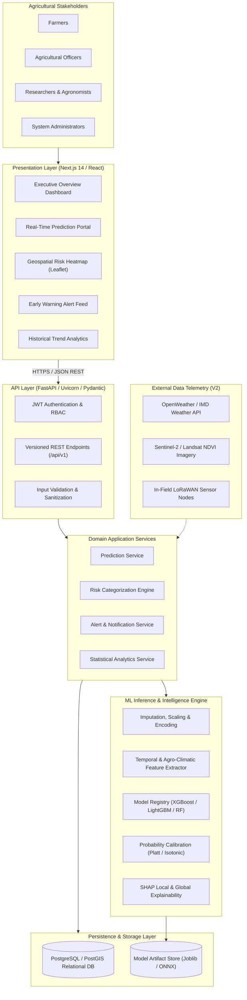
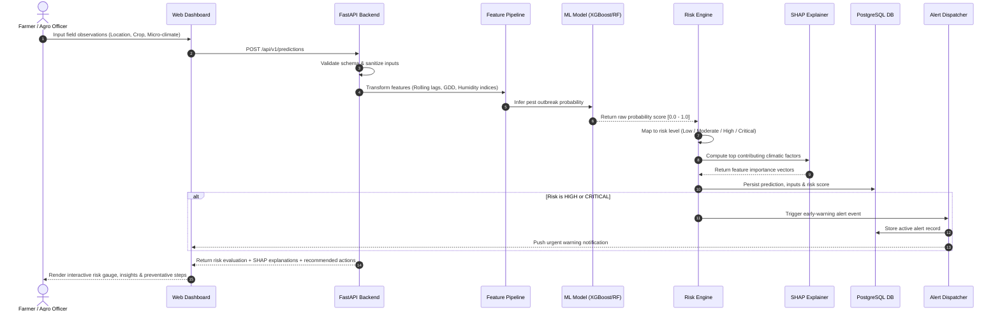
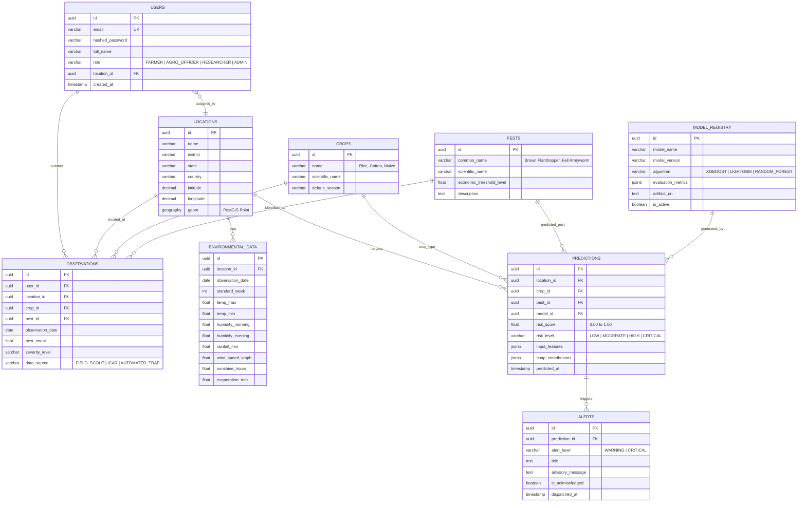
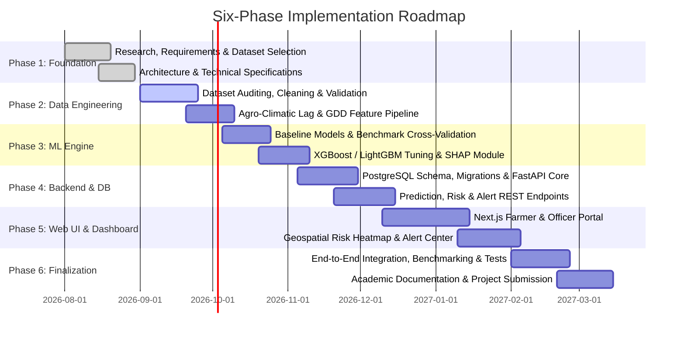

<div align="center">

# 🌾 Intelligent Pest Outbreak Prediction & Early Warning Framework

### *AI-Driven Predictive Surveillance and Proactive Decision Support for Sustainable Agriculture*

[](https://python.org)
[](https://fastapi.tiangolo.com)
[](https://nextjs.org)
[](https://scikit-learn.org)
[](https://xgboost.ai)
[](https://www.postgresql.org)
[](https://github.com/DivyeBhatnagar/Intelligent-Pest-Outbreak-Prediction-Early-Warning-Framework)

<br/>

**Major Academic Project** &nbsp;•&nbsp; **Domain:** AI / ML + AgriTech + Predictive Analytics

</div>

---

## 📌 Table of Contents

- [1. Executive Summary](#1-executive-summary)
- [2. Problem Statement & Motivation](#2-problem-statement--motivation)
- [3. Proposed Solution & Core Value](#3-proposed-solution--core-value)
- [4. System Architecture](#4-system-architecture)
- [5. End-to-End Pipeline & Prediction Flow](#5-end-to-end-pipeline--prediction-flow)
- [6. Datasets & Surveillance Records Analyzed](#6-datasets--surveillance-records-analyzed)
- [7. Core System Features](#7-core-system-features)
- [8. Projected Features (V2 & Future Horizons)](#8-projected-features-v2--future-horizons)
- [9. Machine Learning & Predictive Modeling](#9-machine-learning--predictive-modeling)
- [10. Database Schema & Data Modeling](#10-database-schema--data-modeling)
- [11. Technical Specifications](#11-technical-specifications)
- [12. Six-Phase Implementation Roadmap](#12-six-phase-implementation-roadmap)
- [13. Repository Structure](#13-repository-structure)
- [14. Quickstart & Setup Guide](#14-quickstart--setup-guide)
- [15. Academic Credits & Acknowledgements](#15-academic-credits--acknowledgements)

---

## 1. Executive Summary

Agricultural productivity globally faces severe degradation from sudden pest infestations, precipitating significant crop yield losses, economic instability for farming communities, and excessive, indiscriminate chemical pesticide runoff. Conventional crop protection strategies remain predominantly **reactive**—interventions occur only after visible biomass destruction or field-level population explosion has already materialized.

The **Intelligent Pest Outbreak Prediction & Early Warning Framework** shifts agricultural management from reactive crisis response to **proactive, data-driven prevention**. By integrating historical entomological surveillance records, high-resolution meteorological telemetry (temperature, relative humidity, rainfall, sunshine hours, evaporation, windspeed), and crop phenological states, the framework uses state-of-the-art machine learning models (Gradient Boosted Trees, Random Forest, XGBoost) and SHAP explainability to predict pest outbreak risks with quantifiable lead time before economic injury levels (EIL) are breached.

```
       [ Traditional Approach ]                      [ Our Framework ]
  Pest Outbreak → Crop Damage → Treatment         Data Telemetry → ML Prediction → Early Warning → Targeted Prevention
          (Costly & Reactive)                               (Proactive, Sustainable & Cost-Effective)
```

---

## 2. Problem Statement & Motivation

Pest population surges are bio-climatic phenomena driven by non-linear interactions between ambient heat units (degree-days), vapor pressure deficits, micro-climatic humidity pockets, and host-crop vulnerability windows. 

### Critical Challenges in Modern Pest Surveillance:
1. **Delayed Human Intervention:** Manual scouting over expansive acreage is labor-exhaustive, infrequent, and rarely detects sub-canopy oviposition or nymphal emergence before catastrophic spread.
2. **Environmental & Chemical Degradation:** Blanket prophylactic pesticide spraying destroys natural predator ecosystems, contaminates groundwater aquifers, and accelerates pesticide resistance.
3. **Information Asymmetry:** Farmers in vulnerable agricultural zones lack hyper-localized, timely advisory alerts tailored to micro-climatic shifts.
4. **Underutilized Agro-Climatic Data:** Decades of institutional pest surveillance (e.g., ICAR, state agricultural departments) and daily meteorological measurements remain siloed in paper reports or fragmented spreadsheets without predictive exploitation.

---

## 3. Proposed Solution & Core Value

Our framework bridges empirical agronomy with machine learning into a scalable, explainable, and multi-tier early-warning ecosystem:

* **Predictive Horizon:** Generates 7-to-14-day pest outbreak likelihood scores across Standard Meteorological Weeks (SMW).
* **Multi-Tier Risk Stratification:** Translates calibrated probabilities into actionable operational tiers: `Low`, `Moderate`, `High`, and `Critical`.
* **Explainable AI (XAI):** Unpacks black-box ML outputs via SHAP (SHapley Additive exPlanations) to pinpoint the exact environmental triggers (e.g., prolonged humidity above 90% combined with warm night temperatures).
* **Actionable Advisories:** Equips farmers and agricultural officers with localized mitigation protocols before crop damage hits the Economic Threshold Level (ETL).

---

## 4. System Architecture

The framework implements a clean, modular, service-oriented architecture separating presentation, REST API orchestration, domain services, persistent relational storage, and the dedicated machine learning inference engine.



---

## 5. End-to-End Pipeline & Prediction Flow



---

## 6. Datasets & Surveillance Records Analyzed

The project incorporates real-world agricultural surveillance records and extensive multi-source agronomic datasets located in the [`/Dataset`](./Dataset) directory:

| Dataset File / Asset | Format | Size | Description & Key Features | Primary Research Role |
|---|---|---|---|---|
| **[`RICE.csv`](./Dataset/RICE.csv)** | CSV | ~1.67 MB | Granular weekly entomological field records from ICAR Cuttack spanning multi-year observation cycles. Contains: *Observation Year, Standard Meteorological Week (SMW), Pest Value (Number/hill), Collection Type, MaxT (°C), MinT (°C), Morning Relative Humidity RH1 (%), Evening RH2 (%), Rainfall RF (mm), Wind Speed WS (km/h), Bright Sunshine Hours SSH (hrs), Evaporation EVP (mm), Pest Name (`Brownplanthopper`), Location (`Cuttack`)*. | Primary dataset for longitudinal time-series forecasting, biometeorological thresholding, and insect population surge modeling. |
| **[`Multi_Pest_Weather_Surveillance.csv`](./Dataset/Multi_Pest_Weather_Surveillance.csv)** | CSV | ~55 KB | Micro-climatic surveillance dataset capturing 8 major agricultural pests: *Brownplanthopper, Greenleafhopper, Whitebackedplanthopper, LeafFolder, Yellowstemborer (Light Trap & Pheromone Trap), Gallmidge, Caseworm, and Miridbug* aligned with daily/weekly $MaxT, MinT, RH_1, RH_2, RF, WS, SSH, EVP$. | Multi-class insect pest emergence classification and biometeorological correlation. |
| **[`Smart_Trap_Insect_Catch_Timeseries.csv`](./Dataset/Smart_Trap_Insect_Catch_Timeseries.csv)** | CSV | ~14 KB | High-resolution electronic automated smart trap timeseries capturing insect counts, daily emergence events, hourly temperature deltas, day min/max temperatures, and relative humidity indices. | Validation of IoT smart trap ingestion and real-time edge early warning triggers. |
| **[`TNAU_Crop_Pest_Threshold_and_Control.csv`](./Dataset/TNAU_Crop_Pest_Threshold_and_Control.csv)** | CSV | ~3.2 KB | Official Tamil Nadu Agricultural University (TNAU) and State Agriculture Department surveillance records with Economic Threshold Levels (ETL), growth stage vulnerability, chemical remedies, and biological bio-agents for Rice, Cotton, Sugarcane, and Pulses. | Ground-truth ETL threshold calibration and prescriptive IPM recommendation rules. |
| **[`Pest_Economic_Thresholds_and_IPM.csv`](./Dataset/Pest_Economic_Thresholds_and_IPM.csv)** | CSV | ~10 KB | Comprehensive entomological pest damage database covering *Pink Bollworm, Fall Armyworm (FAW), Stem Borers, and Sucking Pests* with dangerous life stages, diagnostic leaf/boll symptoms, biological parasitoids, and cultural control protocols. | Explanatory decision-support advisory system and threshold warning matrix. |
| **[`Crop_Pest_Phenology_Advisory.csv`](./Dataset/Crop_Pest_Phenology_Advisory.csv)** | CSV | ~2.3 KB | Agronomic crop profiles detailing crop durations (days), seasonal water requirements (mm), optimal temperature & pH ranges, critical growth stages, endemic pests/diseases, and harvesting windows for major Indian staple crops. | Crop phenology matching and growth-stage-sensitive risk adjustment. |
| **[`Historical_Regional_Pest_Infestation.csv`](./Dataset/Historical_Regional_Pest_Infestation.csv)** | CSV | ~56 KB | Historical seasonal infestation logs tracking multi-crop pest life cycle stages (pupa, larvae, adult), seasonal infestation intensities (Low, Moderate, High), and regional distribution. | Seasonal outbreak baseline training and anomaly detection. |
| **[`Cotton_ICAR_Data.xlsx`](./Dataset/Cotton_ICAR_Data.xlsx)** | Excel | ~1.14 MB | Indian Council of Agricultural Research (ICAR) cotton crop pest surveillance records covering bollworm complex (*Helicoverpa armigera*, *Pectinophora gossypiella*) and sucking insect pests (*Aphids, Whiteflies, Jassids, Thrips*) across multiple agro-ecological zones. | Secondary crop validation; multi-crop generalization benchmark. |
| **[`Maize Pest and Diseases Dataset`](./Dataset/Maize%20Pest%20and%20Diseases%20Dataset%20)** | Images + Data | ~36 MB | Visual and tabular dataset containing field imagery and lesion incidence for maize pests (Fall Armyworm *Spodoptera frugiperda*) and endemic foliar diseases (Maize Leaf Blight, Common Rust). | Foundation for projected multimodal vision diagnostics and leaf damage classification. |
| **[`Custom_Crops_yield_Historical_Dataset.csv`](./Dataset/Custom_Crops_yield_Historical_Dataset.csv)** | CSV | ~7.58 MB | Broad historical multi-district agricultural production records detailing acreage, seasonal yield, soil conditions, and climatic variations across diverse Indian states. | Agro-economic damage estimation and yield risk correlation modeling. |
| **[`Pestreport2020-21.pdf`](./Dataset/Pestreport2020-21.pdf)** | PDF | ~2.97 MB | Official Directorate of Plant Protection, Quarantine & Storage (DPPQS) / ICAR Annual Surveillance Bulletin detailing national pest outbreaks, locust warnings, and regional hotspot dynamics. | Domain rule extraction, threshold calibration, and expert ground-truth validation. |

---

## 7. Core System Features

```
┌────────────────────────────────────────────────────────────────────────┐
│                        CORE CAPABILITIES                               │
├─────────────────────┬────────────────────┬─────────────────────────────┤
│ 🎯 Predictive Risk  │ ⚡ Early Warning    │ 🔍 Transparent XAI         │
│ Probability scores  │ Automated alerts   │ SHAP-based feature impact   │
│ & 4-tier risk scale │ with lead-time lead│ explaining the 'why' behind │
│ (Low to Critical)   │ before ETL breach  │ elevated pest risk          │
├─────────────────────┼────────────────────┼─────────────────────────────┤
│ 🌦️ Biometeorology   │ 📊 Role Dashboards │ 🛡️ API-First Architecture   │
│ GDD, RH differentials│ Custom views for   │ Clean FastAPI REST service  │
│ & multi-week lags   │ Farmers, Officers  │ with Pydantic schemas &     │
│                     │ & Researchers      │ automated OpenAPI specs     │
└─────────────────────┴────────────────────┴─────────────────────────────┘
```

- **Dynamic Pest Risk Scoring:** Evaluates multi-parameter observations against trained non-linear classifiers to output a risk score $\in [0.0, 1.0]$.
- **Risk Stratification Matrix:**
  - 🟢 **Low Risk ($P < 0.30$):** Baseline ecological equilibrium; routine scout schedule.
  - 🟡 **Moderate Risk ($0.30 \le P < 0.60$):** Favorable micro-climatic vectors; intensify localized scouting frequency.
  - 🟠 **High Risk ($0.60 \le P < 0.80$):** Impending pest population surge; prepare bio-control / neem-based prophylactic barriers.
  - 🔴 **Critical Risk ($P \ge 0.80$):** Imminent outbreak condition; initiate targeted, IPM-compliant intervention.
- **Micro-Climate Lag Engineering:** Automatically synthesizes standard meteorological week (SMW) temporal rolling averages, cumulative thermal units (degree-days), vapor deficit indices, and precipitation spikes.
- **Explainability (SHAP Integration):** Provides farmers and agronomists with human-interpretable reasons (e.g., *"High risk primarily driven by 84% average relative humidity over the past 14 days and minimum temperature remaining above 20°C"*).

---

## 8. Projected Features (V2 & Future Horizons)

The architectural foundation has been built with clean abstractions to unlock major future expansions:

```mermaid
graph TD
    ROOT["Projected Features & V2 Horizons"] --> F1["Remote Sensing & GIS"]
    ROOT --> F2["Edge IoT & Telemetry"]
    ROOT --> F3["Multimodal Computer Vision"]
    ROOT --> F4["Vernacular Omnichannel Alerts"]
    ROOT --> F5["Prescriptive Agronomy Engine"]

    F1 --> F1a["Sentinel-2 NDVI & NDWI Ingestion"]
    F1 --> F1b["Crop Stress Anomaly Detection"]
    F1 --> F1c["PostGIS Outbreak Heatmaps & Kriging"]

    F2 --> F2a["Solar LoRaWAN Micro-Weather Nodes"]
    F2 --> F2b["Sub-Canopy Humidity Probes"]
    F2 --> F2c["Automated Smart Pheromone Traps"]

    F3 --> F3a["YOLOv8 Edge Pest & Insect Counting"]
    F3 --> F3b["Mobile Leaf Lesion Classification"]
    F3 --> F3c["Lightweight Vision Transformers"]

    F4 --> F4a["WhatsApp Business Conversational Bot"]
    F4 --> F4b["Two-Way Vernacular SMS Advisories"]
    F4 --> F4c["Automated IVR Regional Voice Calls"]

    F5 --> F5a["Bio-Pesticide Dosage Calculator"]
    F5 --> F5b["Natural Predator Population Protection"]
    F5 --> F5c["Economic Threshold ETL Cost-Benefit Evaluator"]
```



### 🛰️ 1. Satellite Remote Sensing & Vegetation Indices
* Integration of **Copernicus Sentinel-2** multispectral surface reflectance data.
* Calculation of **NDVI** (Normalized Difference Vegetation Index) and **NDWI** (Normalized Difference Water Index) to detect canopy vigor drop-offs and leaf desiccation before visible ground symptoms emerge.

### 📡 2. In-Field IoT & Wireless Sensor Network (WSN)
* Ingestion of telemetry from solar-powered **LoRaWAN micro-stations** measuring sub-canopy micro-climate (temperature, leaf wetness duration, canopy relative humidity, and soil moisture).
* Automated smart pheromone electronic traps with optical insect trip sensors for real-time pest count feeds.

### 📸 3. Mobile Multimodal Computer Vision Diagnostics
* On-device or edge deployment of **YOLOv8 / MobileNetV4** for instant in-field insect recognition and leaf lesion bounding box detection from smartphone photos taken by farmers.
* Direct fusion of visual severity scores with predictive climate models to provide a dual-verification early-warning score.

### 📲 4. Vernacular Multi-Channel Alert Dispatch
* Integration with **WhatsApp Business API** and **Kisan Call Center / IVR** telephone automation to broadcast voice warnings in regional languages (Hindi, Odia, Telugu, Marathi, etc.) to farmers without smartphone access.
* Two-way interactive USSD/SMS query system: *"Reply 1 to report BPH sighting"*.

### 🗺️ 5. Spatio-Temporal Diffusion & Geospatial Kriging
* Geospatial outbreak propagation modeling utilizing **PostGIS** spatial indexing.
* Spatial **Gaussian Process / Kriging** interpolation to forecast how pest swarms will migrate across contiguous taluks and administrative blocks over 7-to-21 days.

### 🌿 6. Prescriptive IPM & Bio-Pesticide Decision Recommender
* Non-chemical and Integrated Pest Management (IPM) advisory generation: recommending specific bio-agents (e.g., *Trichogramma* parasitoids, *Beauveria bassiana* fungi, or neem oil sprays) based on the exact growth stage of the crop, avoiding pollinator toxicity.

---

## 9. Machine Learning & Predictive Modeling

### 9.1 Mathematical Formulation

#### 1. Outbreak Risk Probability:
Given an input vector $\mathbf{x} = [x_1, x_2, \dots, x_n] \in \mathcal{X}$ representing meteorological lags, standard meteorological week indices, and crop stages, the ensemble estimator outputs calibrated probability $P(Y = 1 \mid \mathbf{x})$:

$$P(Y = 1 \mid \mathbf{x}) = \sigma\left(\sum_{m=1}^{M} f_m(\mathbf{x})\right)$$

where $f_m(\mathbf{x})$ denotes individual decision tree stumps in an XGBoost/Gradient Boosted ensemble, and $\sigma(\cdot)$ is the logistic link function.

#### 2. Bio-Climatic Thermal Unit Accumulation (Growing Degree-Days - GDD):
Insects are poikilothermic organisms whose development rate depends on cumulative ambient thermal units above a base physiological threshold ($T_{base}$):

$$\text{GDD} = \sum_{t=1}^{N} \max\left( \frac{T_{max, t} + T_{min, t}}{2} - T_{base}, \; 0 \right)$$

#### 3. Early Warning Lead Time Metric:
System performance is evaluated not merely on traditional static accuracy, but on actionable temporal lead time:

$$\text{LeadTime} = T_{\text{outbreak}} - T_{\text{warning}}$$

Where:
- $T_{\text{outbreak}}$ = Timestamp when field pest count exceeds the Economic Threshold Level (ETL).
- $T_{\text{warning}}$ = Timestamp when the framework emitted an elevated risk warning ($P \ge 0.60$).

Target operational performance: $\text{LeadTime} \ge 7 \text{ to } 14 \text{ days}$ with a False Alarm Ratio $\text{FAR} < 0.15$.

---

## 10. Database Schema & Data Modeling

The relational database architecture is modeled in PostgreSQL to maintain strict relational integrity across users, farms, sensor readings, model versions, and alerts.



---

## 11. Technical Specifications

```
                       TECHNOLOGY STACK MATRIX
┌───────────────────────┬──────────────────────────────────────────────┐
│ Layer                 │ Technologies                                 │
├───────────────────────┼──────────────────────────────────────────────┤
│ 🖥️ Presentation        │ Next.js 14, React 18, TypeScript, TailwindCSS│
│                       │ Recharts, Lucide Icons, Leaflet / MapLibre   │
├───────────────────────┼──────────────────────────────────────────────┤
│ ⚡ Backend API         │ Python 3.11+, FastAPI, Uvicorn, Pydantic v2  │
│                       │ SQLAlchemy 2.0 (Async), Alembic, PyJWT       │
├───────────────────────┼──────────────────────────────────────────────┤
│ 🧠 Machine Learning   │ Scikit-Learn, XGBoost, LightGBM, CatBoost    │
│                       │ Pandas, NumPy, SciPy, SHAP, Joblib, Optuna   │
├───────────────────────┼──────────────────────────────────────────────┤
│ 🗄️ Persistence & Cache│ PostgreSQL 16 (with PostGIS), Redis 7        │
├───────────────────────┼──────────────────────────────────────────────┤
│ 🛠️ DevOps & Tooling   │ Docker, Docker Compose, Git, GitHub Actions  │
└───────────────────────┴──────────────────────────────────────────────┘
```

---

## 12. Six-Phase Implementation Roadmap

The framework follows a disciplined 6-phase engineering lifecycle:



| Phase | Designation | Key Milestone Deliverables | Status |
|---|---|---|:---:|
| **Phase 1** | **Research, Requirements & Dataset** | Problem Statement, Scope, PRD, TRD, Architecture, Dataset acquisition | **Completed** ✅ |
| **Phase 2** | **Data Engineering & EDA** | Cleaning pipelines, missing-value imputation, biometeorological lag features | **In Progress** 🔄 |
| **Phase 3** | **Machine Learning & Prediction** | Multi-model evaluation (RF, XGBoost), probability calibration, SHAP explainer | **Scheduled** ⏳ |
| **Phase 4** | **Backend, Database & API** | PostgreSQL/PostGIS migrations, FastAPI async endpoints, JWT authentication | **Scheduled** ⏳ |
| **Phase 5** | **Frontend, Dashboard & Warning** | Next.js responsive UI, risk dials, geographic maps, alert notifications | **Scheduled** ⏳ |
| **Phase 6** | **Integration, Validation & Docs** | Comprehensive E2E testing, Docker packaging, academic report & defense | **Scheduled** ⏳ |

---

## 13. Repository Structure

```text
Intelligent-Pest-Outbreak-Prediction-Early-Warning-Framework/
├── README.md                                  # Comprehensive project documentation
├── .gitignore                                 # Git ignore rules for Python, Node, OS files
│
├── Dataset/                                   # Real-world agricultural & pest datasets
│   ├── RICE.csv                               # ICAR Cuttack Brown Planthopper surveillance dataset
│   ├── Multi_Pest_Weather_Surveillance.csv    # 8-Pest agro-climatic weekly observation dataset
│   ├── Smart_Trap_Insect_Catch_Timeseries.csv # Automated electronic insect trap timeseries
│   ├── TNAU_Crop_Pest_Threshold_and_Control.csv # TNAU official ETL & IPM control guidelines
│   ├── Pest_Economic_Thresholds_and_IPM.csv   # Detailed bio-agent & chemical threshold reference
│   ├── Crop_Pest_Phenology_Advisory.csv       # Crop growth duration, water, temp & stage data
│   ├── Historical_Regional_Pest_Infestation.csv # Multi-state seasonal pest outbreak records
│   ├── Cotton_ICAR_Data.xlsx                  # ICAR multi-district cotton pest surveillance
│   ├── Maize Pest and Diseases Dataset/       # Visual images & foliar damage datasets
│   ├── Custom_Crops_yield_Historical_Dataset.csv # Historical yield & crop statistics
│   ├── Pestreport2020-21.pdf                  # Official National DPPQS / ICAR Surveillance Bulletin
│   └── csv                                    # Mandi price and crop arrival records
│
└── Documentation/                             # Architectural specifications & requirements
    ├── Overview.md — Intelligent Pest Outbreak Prediction & Early Warning Framework.md
    ├── PRD — Intelligent Pest Outbreak Prediction & Early Warning Framework.md
    ├── TRD.md — Intelligent Pest Outbreak Prediction & Early Warning Framework.md
    ├── Architecture.md — Intelligent Pest Outbreak Prediction & Early Warning Framework.md
    └── IMPLEMENTATION_PLAN_V1.md — Intelligent Pest Outbreak Prediction & Early Warning Framework.md
```

---

## 14. Quickstart & Setup Guide

### Prerequisites
- **Python:** Version 3.11 or higher
- **Node.js:** Version 18.x or 20.x LTS
- **PostgreSQL:** Version 15+ (with PostGIS extension recommended)
- **Git**

### 1. Clone the Repository
```bash
git clone https://github.com/DivyeBhatnagar/Intelligent-Pest-Outbreak-Prediction-Early-Warning-Framework.git
cd Intelligent-Pest-Outbreak-Prediction-Early-Warning-Framework
```

### 2. Python Environment Setup
```bash
# Create virtual environment
python3 -m venv venv
source venv/bin/activate  # On Windows: venv\Scripts\activate

# Install baseline dependencies
pip install numpy pandas scikit-learn xgboost lightgbm shap fastapi uvicorn pydantic sqlalchemy psycopg2-binary
```

### 3. Explore the Documentation
The comprehensive system design and technical requirements are indexed under [`Documentation/`](./Documentation):
- 📘 **Overview:** [Project Overview](./Documentation/Overview.md%20—%20Intelligent%20Pest%20Outbreak%20Prediction%20&%20Early%20Warning%20Framework.md)
- 📋 **PRD:** [Product Requirements Document](./Documentation/PRD%20—%20Intelligent%20Pest%20Outbreak%20Prediction%20&%20Early%20Warning%20Framework.md)
- 📐 **Architecture:** [System Architecture](./Documentation/Architecture.md%20—%20Intelligent%20Pest%20Outbreak%20Prediction%20&%20Early%20Warning%20Framework.md)
- 🔧 **TRD:** [Technical Requirements Document](./Documentation/TRD.md%20—%20Intelligent%20Pest%20Outbreak%20Prediction%20&%20Early%20Warning%20Framework.md)
- 🗺️ **Roadmap:** [Implementation Plan v1.0](./Documentation/IMPLEMENTATION_PLAN_V1.md%20—%20Intelligent%20Pest%20Outbreak%20Prediction%20&%20Early%20Warning%20Framework.md)

---

## 15. Academic Credits & Acknowledgements

- **Author / Developer:** Divye Bhatnagar, Faizan Ali Rahman, Gunika, Shatakshi
- **Academic Mentor:** Dr. Swati Vashisht
- **Institution:** IILM University
- **Project Domain:** Artificial Intelligence, Machine Learning, AgriTech, and Disaster Mitigation
- **Data Acknowledgement:** Indian Council of Agricultural Research (ICAR), Directorate of Plant Protection, Quarantine & Storage (DPPQS), and open agricultural repositories for providing surveillance records that support empirical agricultural modeling.

---

<div align="center">
  <sub>Built with dedication for resilient, sustainable, and data-empowered agriculture.</sub>
</div>
